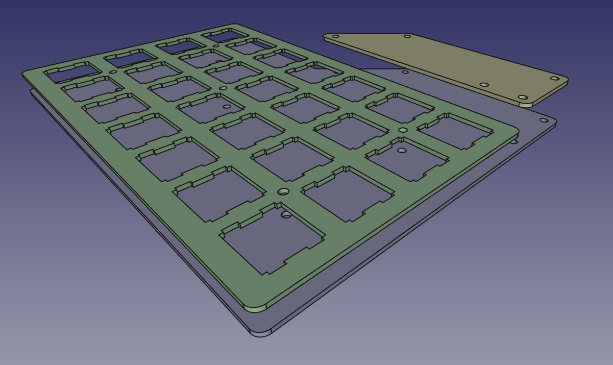

# DON'T MANUFACTURE ANYTHING YET

## Foreword

I was really missing PCB like case for this keyboard, but I didn't want to
just manually one-shot go through already existing acrylic case files to gerbers
process (e.g. with [svg2shenzhen](https://github.com/badgeek/svg2shenzhen)).
Instead, I tried to make few additions / automations and learn something useful
along.

## Process description

Case is redesigned in FreeCAD to achieve pure mechanical and parametric description.
Exported DXFs are later manually imported in clean KiCad's PCB as edge cuts.
After this, one can use few scripts through prepared [invoke](http://www.pyinvoke.org/)
commands to do following:

- `inv circles2holes`: changes every true circle on edge cuts layer into mounting hole
- `inv plot`: creates gerbers and zippes them
- `inv verify`: simple verifier for drills between board, plate, bottom and cover (uses fab files)

## FreeCAD design notes

After few times starting over, I used master sketch approach learned with mr
Ha Gei's [video](https://www.youtube.com/watch?v=8Bmcgn2RBGI). Measurments comes
from either PCB files or already existing acrylic case files.

From FreeCAD we can freely export DXF of every element (Autodesk DXF 2D (\*.dxf)).

## KiCad design notes

DXFs are manually imported in PCB. After that KiCad can be closed at all,
rest is done via the scripts.

## Verification design notes

Verifications use drill fab files. Logic is quite simple: we do know sets of
drills between the designs which should match, so we do cross check those. List
of holes is normalized (bottom left becomes origin) and diffed between.

## Software versions and installation notes

- FreeCAD 0.18
- KiCad 5.1.2
- Python 3.7.3

Installing python requirements - advised to do this onto system python with
`--user` switch, which would allow to use KiCad's libraries and everything needed
by this repository.
